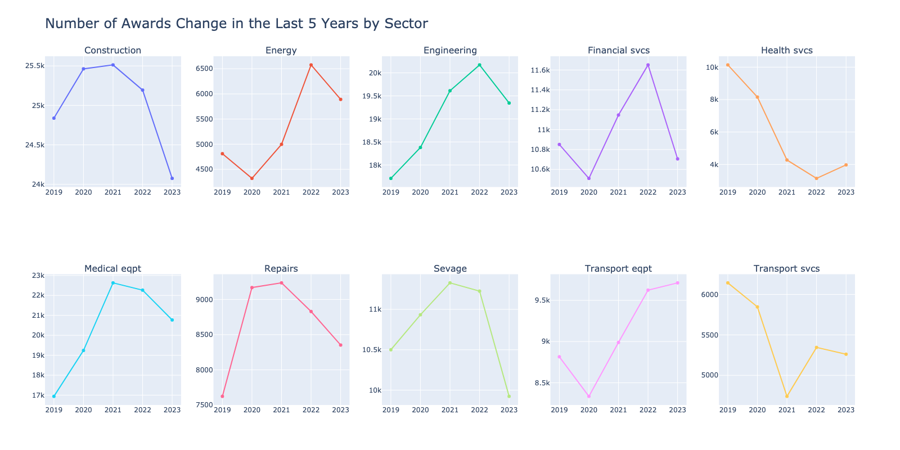
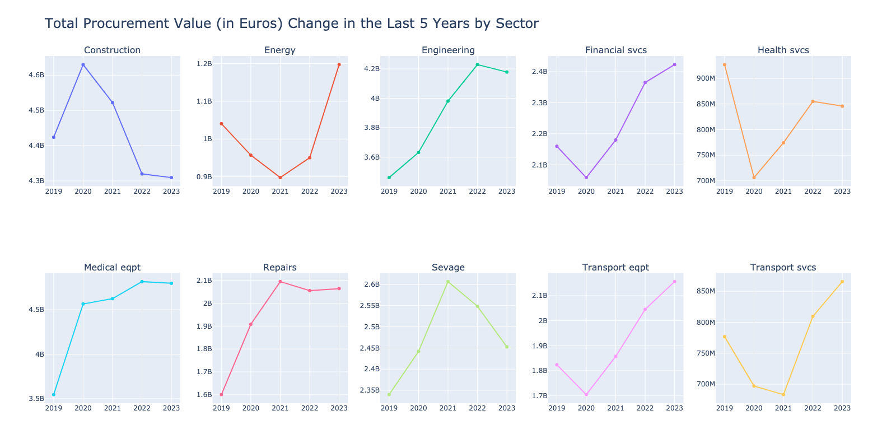
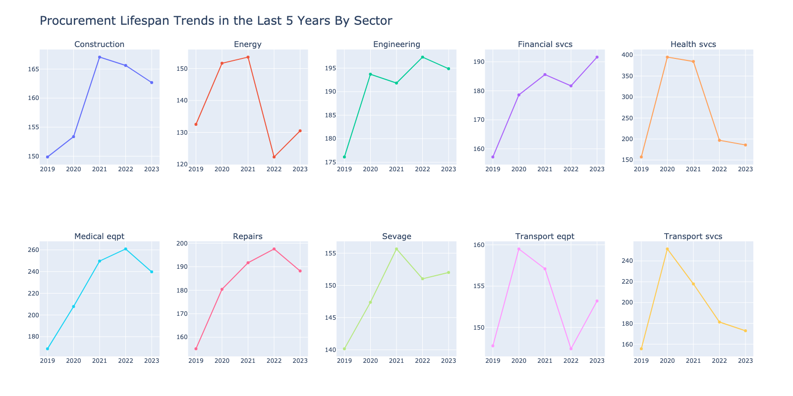
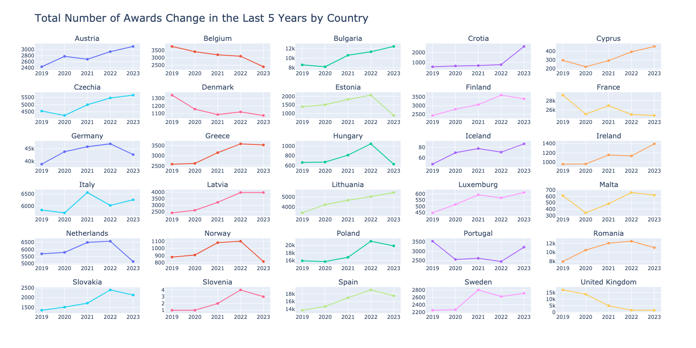
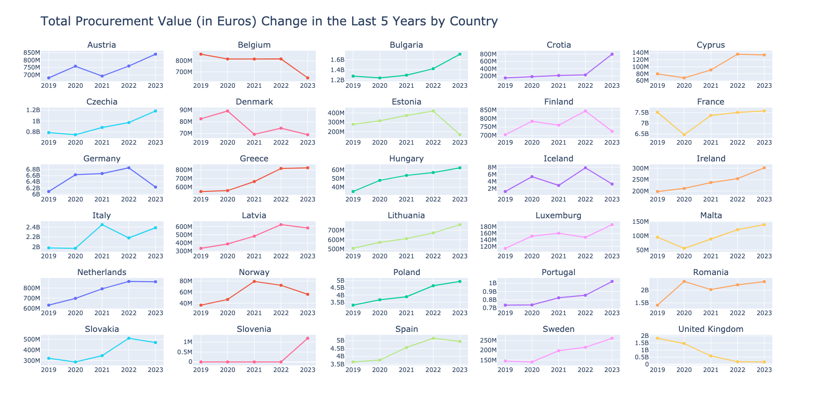
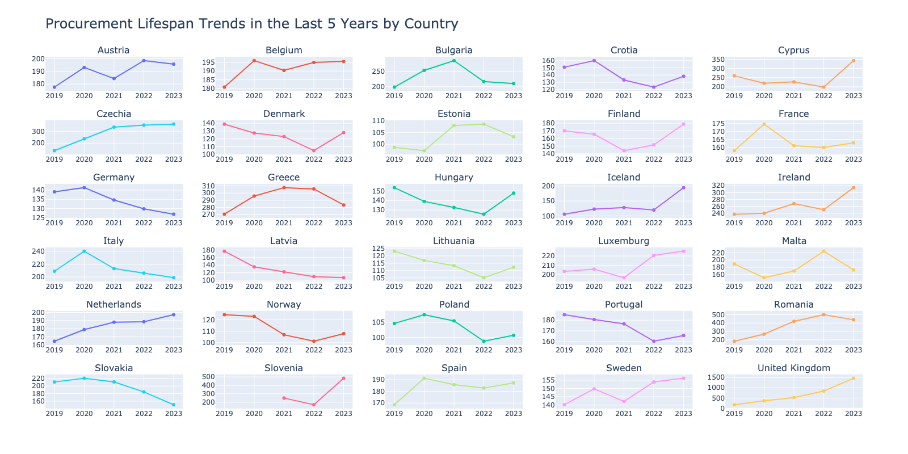

## European Procurement Market Statistics - Data Analysis

In the procurement market, staying updated of the latest trends is crucial for businesses, policymakers, and industry enthusiasts. As we bid farewell to another year, it's a good time to look back at how things have been in the procurement world for the last five years.

Thanks to Tenders Economic Daily (TED) [1], up to date european procurement market data is available and shared every weekday. By inspiring from the interactive dashboard of European Court of Auditors [2], this report shows number of awards, size of the economic activity and lifespan of the procurement processes by the same 30 countries and 10 sectors throughout the years. In contrast to ECA dashboard, the following charts cover even the last week's publication but in a narrow scope in static manner.

### References
- [1] https://ted.europa.eu/TED/browse/browseByMap.do
- [2] https://public.tableau.com/app/profile/eca.public.procurement/viz/eca_dashboard_17002195654680/Story?publish=yes
